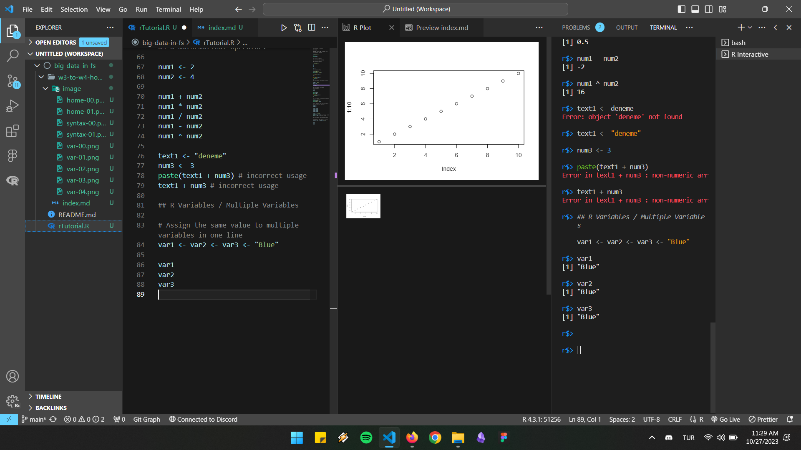
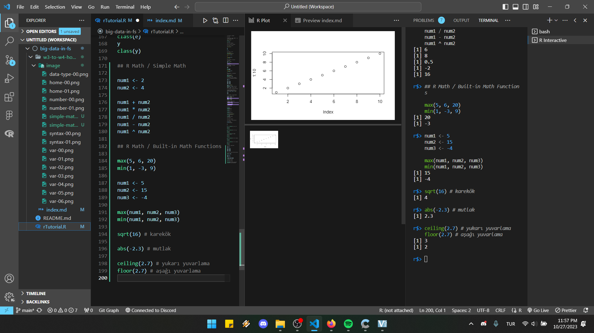

# R - Homework

Adı Soyadı : Aysu İğdi  
Numara : 200207016

## R Tutorial

### R Home


### R Intro (reading)

### R Get Started (reading)

### R Syntax

#### Syntax


#### Print

Click for [details](#variables-print-output).

```
However, R does have a print() function available if you want to use it. This might be useful if you are familiar with other programming languages, such as Python, which often uses the print() function to output code.

And there are times you must use the print() function to output code, for example when working with `for loops` (which you will learn more about in a later chapter):
```


### R Comments

### R Variables

#### Variables #creating

```
R does not have a command for declaring a variable.

A variable is created the moment you first assign a value to it.
```


`CTRL + ENTER` ile kod run edilmiyor. Terminale "name" veya "age" variablelarını istediğimizi anlatmamız gerekiyor. --- JS'te fonksiyon adıyla fonksiyon sonucunu çağırmak gibi.

```
In other programming language, it is common to use = as an assignment operator. In R, we can use both = and <- as assignment operators.

[important] -- However, <- is preferred in most cases because the = operator can be forbidden in some context in R.
```

#### Variables #print-output


`CTRL + ENTER` çalıştığı formlar:

1. `*.R` içerisinde değişken adının tanımlama sonrasında yalnız yazılması ve bu satırın çalıştırılması (satır:49-50).
2. `*.R` içerisinde `print(var-name)` yazılıp bu satırın çalıştırılması.

#### Concatenate Elements

Değişkenin bir kere çalıştırılmış olması gerekiyor. Aksi durumda paste objeyi algılayamıyor.


```
For numbers, the + character works as a mathematical operator:
```


```
`+ - * / ^` operatörleri de çalışıyor.
```

Hatalı kullanımlar:


#### Multiple Variables



```
ALT + ENTER  === CTRL + ENTER
```

#### Variable Names


```
Remember that variable names are case-sensitive!
```

### R Data Types


### R Numbers

#### Type Conversion


### R Math

#### Simple Math


#### Built-in Math Functions




### R Strings

#### [String: String Literals](#string-multiline-strings)

#### [String: Assign a String to a Variable](#string-multiline-strings)

#### String: Multiline Strings

```
If you want the line breaks to be inserted at the same position as in the code, use the cat() function:
```


#### [String: String Length](#string-combine-two-strings)

#### [String: Check a String](#string-combine-two-strings)

```
Use the grepl() function to check if a character or a sequence of characters are present in a string:
```

#### String: Combine Two Strings


#### Escape Characters

| Code | Result          |
| ---- | --------------- |
| \\   | Backslash       |
| \n   | New Line        |
| \r   | Carriage Return |
| \t   | Tab             |
| \b   | Backspace       |


### R Booleans

## 

### R Operators

#### Arithmetic operators

| Operator | Name                              | Example |
| -------- | --------------------------------- | ------- |
| +        | Addition                          | x + y   |
| -        | Subtraction                       | x - y   |
| \*       | Multiplication                    | x \* y  |
| /        | Division                          | x / y   |
| ^        | Exponent                          | x ^ y   |
| %%       | Modulus (Remainder from division) | x %% y  |
| %/%      | Integer Division                  | x%/%y   |

#### [Assignment operators](#comparison-operators)

```
Note: <<- is a global assigner. You will learn more about this in the Global Variable chapter.
```

#### Comparison operators

| Operator | Name                     | Example |
| -------- | ------------------------ | ------- |
| ==       | Equal                    | x == y  |
| !=       | Not equal                | x != y  |
| >        | Greater than             | x > y   |
| <        | Less than                | x < y   |
| >=       | Greater than or equal to | x >= y  |
| <=       | Less than or equal to    | x <= y  |


#### Logical operators (reading)

- & - Element-wise Logical AND operator. It returns TRUE if both elements are TRUE
- && - Logical AND operator - Returns TRUE if both statements are TRUE
- | - Elementwise- Logical OR operator. It returns TRUE if one of the statement is TRUE
- || - Logical OR operator. It returns TRUE if one of the statement is TRUE.
- ! - Logical NOT - returns FALSE if statement is TRUE

#### Miscellaneous operators (reading)

| Operator | Description                                | Example      |
| -------- | ------------------------------------------ | ------------ |
| :        | Creates a series of numbers in a sequence  | x <- 1:10    |
| %in%     | Find out if an element belongs to a vector | x %in% y     |
| %\*%     | Matrix Multiplication x <- Matrix1         | %\*% Matrix2 |

### [R If...Else](#the-if-statement)

#### [If...Else: Conditions and If Statements (reading)](#the-if-statement)

#### If...Else: The if Statement


#### Nested If


#### And Or

| A   | B   | AND | OR  |
| --- | --- | --- | --- |
| 0   | 0   | 0   | 0   |
| 0   | 1   | 0   | 1   |
| 1   | 0   | 0   | 1   |
| 1   | 1   | 1   | 1   |


### R While Loop

```
With the while loop we can execute a set of statements as long as a condition is TRUE:
```


#### Break


#### Next


#### If .. Else Combined with a While Loop


### R For Loop


#### Break & Next


#### If .. Else Combined with a For Loop


#### Nested Loop


### R Functions


