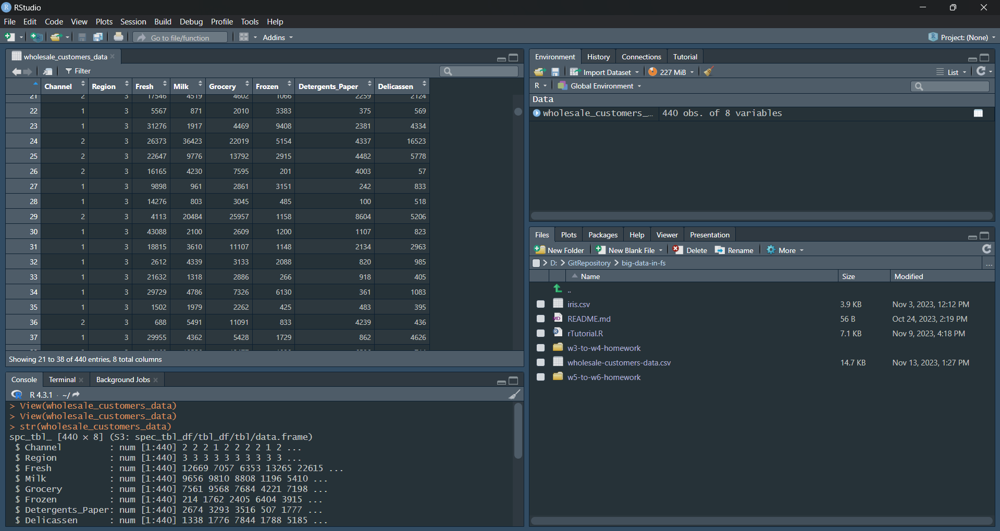
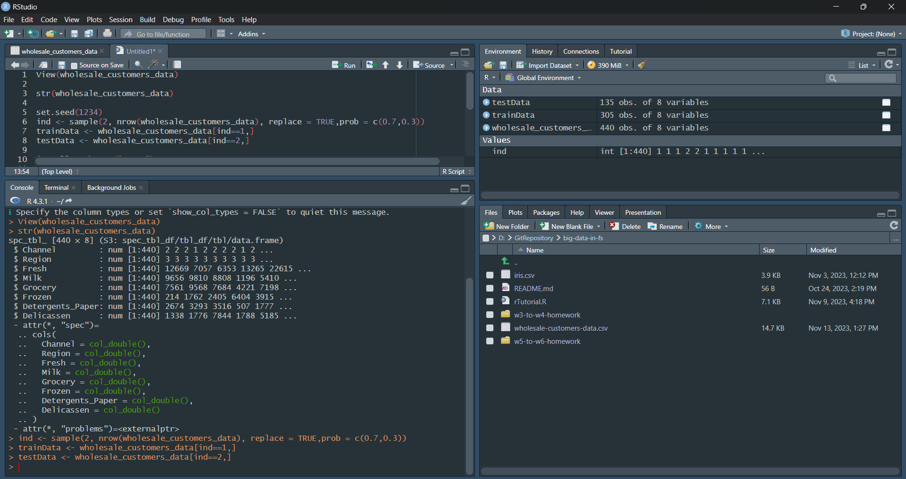
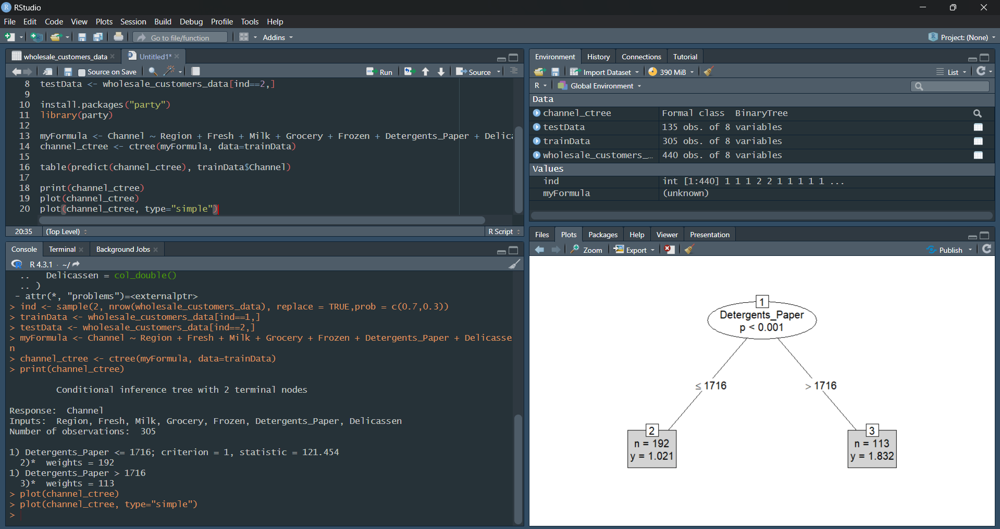
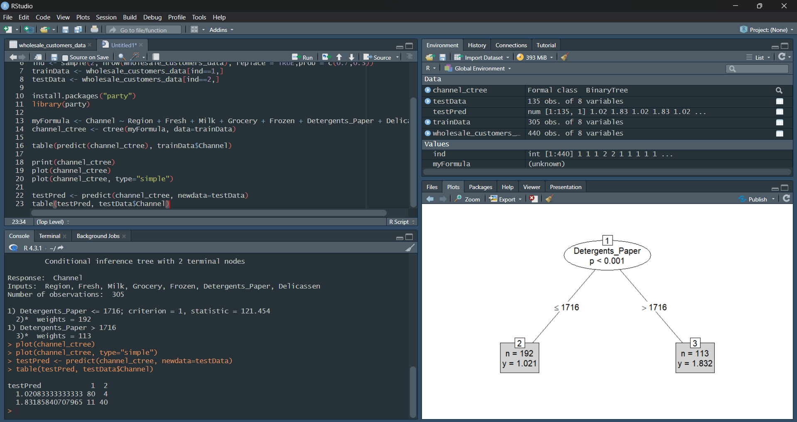
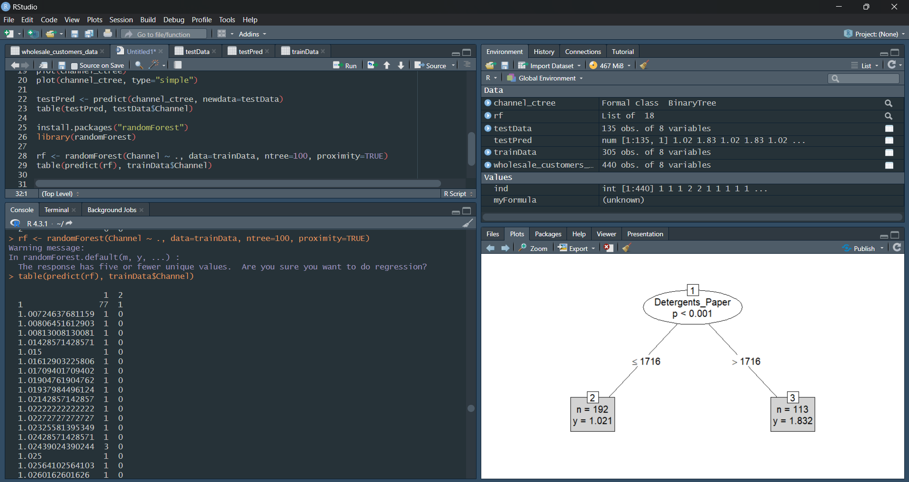
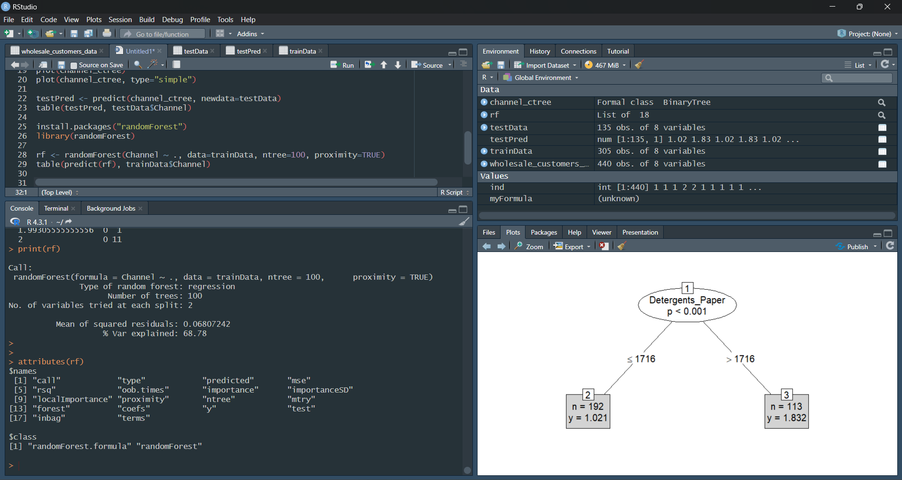
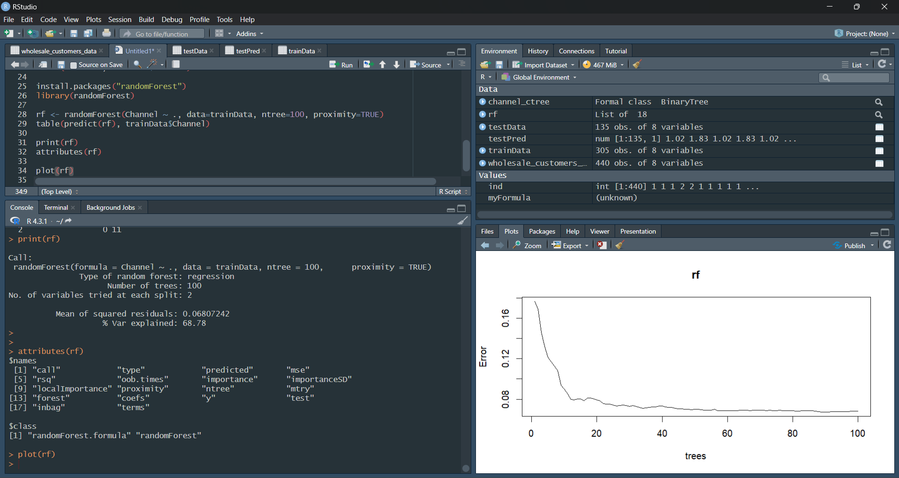
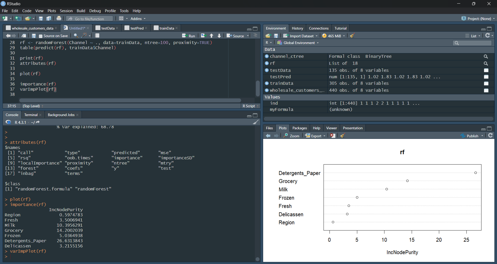
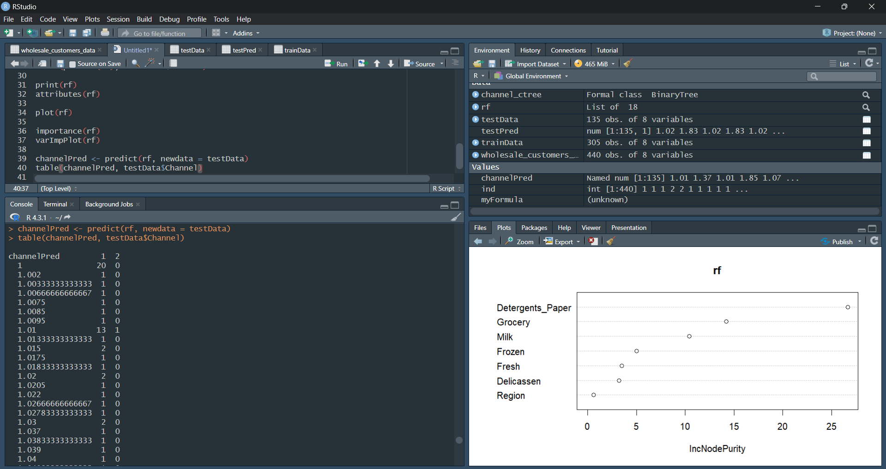

# Ödev 2: Decision Tree and Random Forest

Adı Soyadı : Aysu İğdi  
Numara : 200207016

GitHub [repository linki](https://github.com/igdiaysu/big-data-in-fs/tree/main/w5-to-w6-homework/)

# Decision Tree and Random Forest

## Decision Trees

## trainData

## predict with testData

testData'da 91 adet `channel=1` değerinin 80 adetini doğru, 11 adetini yanlış; 44 adet `channel=2` değerinin 40 adetini doğru, 4 adetini yanlış tahmin etti.

## Random Forest

### attributes

